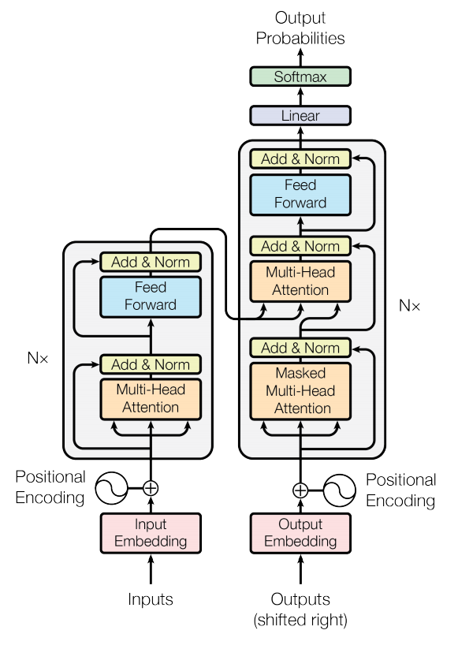
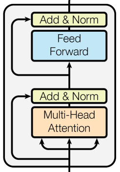
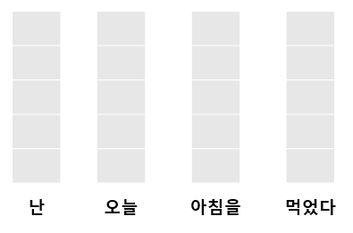
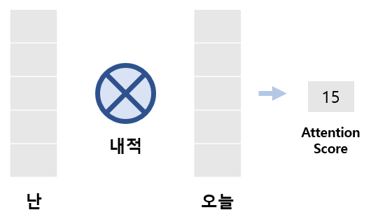
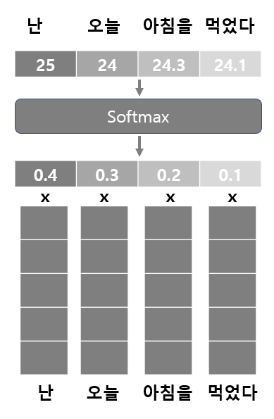
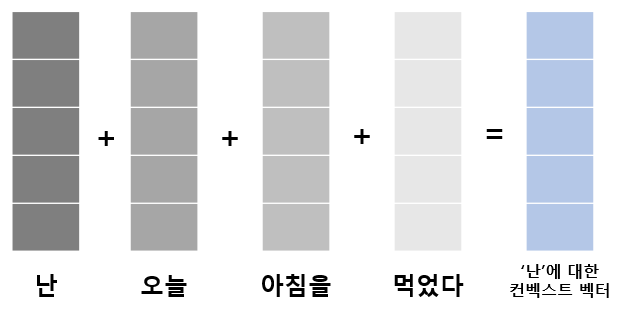

# Intro

2017 NIPS에서 구글이 소개한 Transformer은 NLP에서 큰 주목을 받았다. 기존의 CNN과 RNN이 주를 이뤘던 연구에서 새로운 모델을 제안했기 때문이다.

**Recurrent neural networks (RNN)**는 t번째의 output을 얻기위해 t번째 input과 t-1번쨰 hidden state가 필요하다. 이는 모델의 병렬화를 막고 *Long term dependency*문제가 있다.  

이것을 해결하기 위해 제안된 모델은 **Long Short Term Memory (LSTM)**이다. **LSTM**은 입력값과 이전의 출력값을 얼마나 사용하거나 잃어바릴지를 고려하는 gate를 추가하여 멀리있는 단어에도 영향을 전달 할 수 있도록한다. 하지만 이 방법도 거리의 한계는 있고 병렬처리의 어려움이 있다.   이를 해결하기 위해 ***Attention***을 사용하였다.

 

# Model

</img>

모델의 전체 구조는 **Encoder**과 **Decoder**로 구성 되어있다.  

 

# Encoder

</img>

**Encoder**를 나눠보면 2개의 sub layer(Self-Attention layer, Feed Forward layer)로 구분된다. 

인코더에 들어온 Input은 Self-Attention layer를 먼저 지난다.   *Self-Attention*이란 각 문장에서 각 단어끼리 얼마나 관계가 있는지를 계산해서 반영하는 방법이다.  각 단어와 다른 단어들 사이의 관계값을 계산한다. 이 관계값을 Attention Score라 한다. 

다음과 같은 단어 벡터가 입력으로 들어왔다고 하자.

</img>

 

텍스트의 정보를 벡터로 표현하여 유사도를 계산한다. 유사도를 계산하는 방법에는 내적, 맨해튼 dist등이 있지만 Transformer 모델에선 내적을 사용한다.

</img>

 

- 각 단어들의 Attention Score를 구한 후 Softmax를 사용하여 Attention Score를 확률값으로 표현한다.
- 확률값으로 표현한 Attention Score를 각 단어벡터와 곱 한후 더해서 컨벡스트 벡터를 구한다.

</img>

 </img>

 

sample link [blog]

[blog]: https://supernova817.github.io
